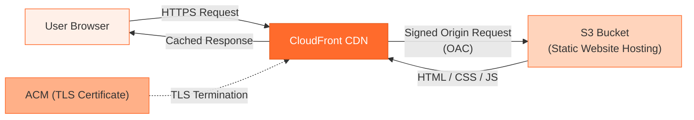

# ToDo Kanban Board — S3 + CloudFront

A fully static Kanban board for managing tasks with drag-and-drop.  
Built with **HTML**, **CSS**, and **JavaScript** — no frameworks, no build step.

- Three columns: **To Do → In Progress → Done**
- Drag & drop tasks between columns (HTML5 Drag & Drop API)
- Add / Edit / Delete tasks inline
- Persistent board state via `localStorage`
- Clean white + orange theme with smooth transitions

---

## Cloud Architecture — Static Hosting on AWS

The application is hosted on **Amazon S3** and distributed globally through **Amazon CloudFront**, which provides edge caching and automatic HTTPS within the **AWS Free Tier** limits.

### 1. S3 Bucket (Static Website Hosting)

Steps:

1. Created an S3 bucket with a globally unique name in `eu-central-1`.
2. Enabled **Static website hosting** and set:
   - Index document: `index.html`
   - Error document: `error.html`
3. Uploaded the static assets to the bucket root:
   - `index.html`
   - `error.html`
   - `style.css`
   - `app.js`
4. Initially configured a public **bucket policy** to allow `s3:GetObject` on all objects (lab phase, pre‑CloudFront).

> Design note: The bucket website endpoint is now used only as the origin; the public access is locked down once CloudFront + OAC are in place.

---

### 2. CloudFront Distribution (CDN + HTTPS)

Steps:

1. Created a **CloudFront distribution** with the S3 website endpoint as the **origin domain** (origin type: `S3 static website`).
2. Enabled **Origin Access Control (OAC)** so that only CloudFront can fetch objects from the S3 bucket:
   - Associated the OAC with the origin.
   - Updated the S3 bucket policy using the JSON generated by CloudFront, granting `s3:GetObject` only to the distribution’s `AWS:SourceArn`.
3. Viewer settings:
   - Viewer protocol policy: **Redirect HTTP to HTTPS**
   - Default root object: `index.html`
4. TLS / certificates:
   - Used **AWS Certificate Manager (ACM)** to provide an SSL certificate for the CloudFront domain, enabling HTTPS without managing keys manually.
5. Caching:
   - Configured default TTL (e.g. 1 day) for HTML and longer TTLs for static assets (CSS/JS) to take advantage of edge caching.

> Design note: CloudFront terminates TLS at the edge, caches content close to users, and talks to S3 over signed requests via OAC. Direct public access to the bucket can be disabled, following AWS best practices for private S3 origins.

---

### 3. Security & Access Control

- **Origin Access Control (OAC)**:
  - Ensures the S3 bucket is **not publicly accessible**, and all traffic goes through CloudFront.
  - Bucket policy restricts `s3:GetObject` to the CloudFront distribution using `AWS:SourceArn` conditions .
- **Block Public Access**:
  - Once OAC is configured and tested, S3 **Block Public Access** can be re‑enabled for the bucket to enforce private origin behavior.
- **Threat model**:
  - Prevents users from bypassing CloudFront and accessing S3 directly.
  - Centralizes security (rate limiting, WAF, caching) at the CDN layer.

### Architecture Diagram

