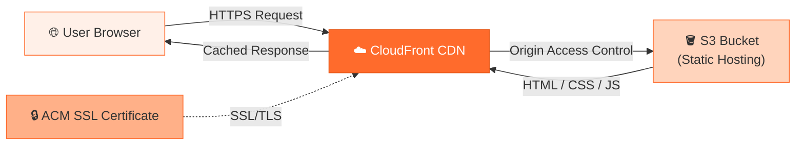

# ToDo Kanban Board — S3 hosting

A sleek, fully static Kanban board for managing tasks with drag-and-drop. Built with pure **HTML**, **CSS**, and **JavaScript** — no frameworks, no build step.

- **Three columns**: To Do → In Progress → Done
- **Drag & drop** tasks between columns (HTML5 API)
- **Add / Edit / Delete** tasks inline
- **Persistent** — board state saved in `localStorage`
- **White & orange** accent theme with smooth animations

---

## Cloud Architecture — Static Hosting con S3 + CloudFront

The static website is hosted on **Amazon S3** and distributed globally through **CloudFront**, leveraging edge caching and automatic HTTPS — all within the **AWS Free Tier**.

### S3 Bucket

- Enable **Static website hosting** on the bucket
- Upload `index.html`, `style.css`, `app.js`
- Configure the **public bucket policy** (`s3:GetObject`) to allow read access
- Disable **Block Public Access** only for this bucket

### CloudFront Distribution

- Create a CloudFront distribution with the S3 bucket as **origin**
- Use **Origin Access Control (OAC)** for better security (direct access to the bucket only from CloudFront)
- Select **AWS Certificate Manager (ACM)** for free SSL certificate (HTTPS)
- Set **TTL caching** (e.g., 1 day for `index.html`, longer for static assets)

### Result

Global HTTPS URL with **reduced latency** thanks to CloudFront edge locations. Verify with:

```bash
curl -I https://<your-distribution>.cloudfront.net/
```

---

### Architecture Diagram


